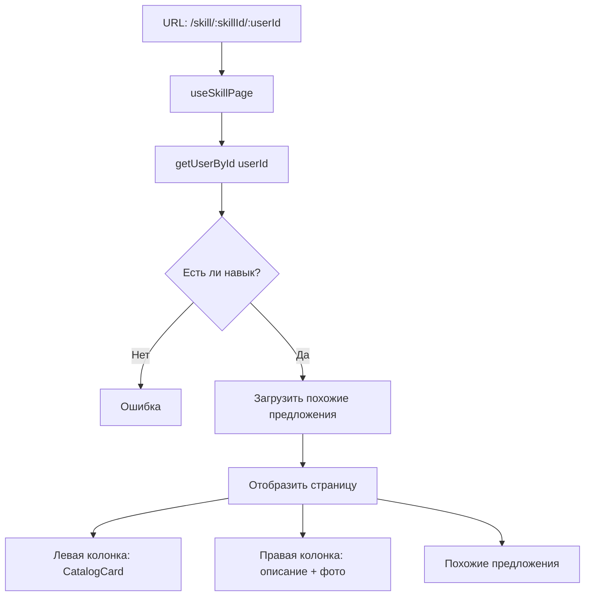
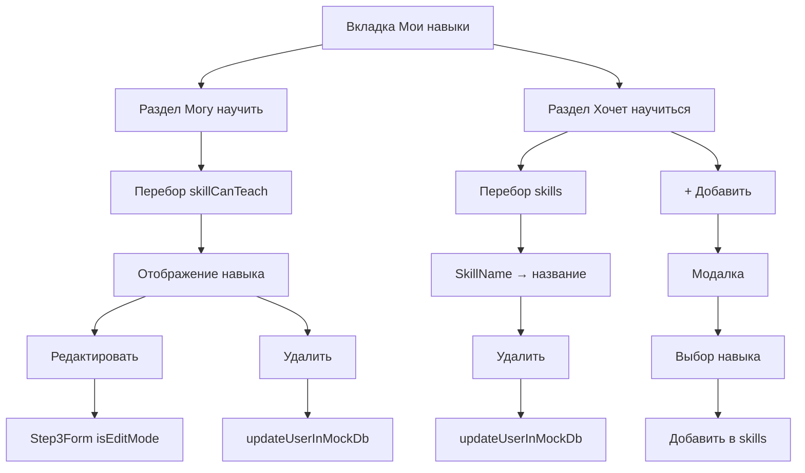
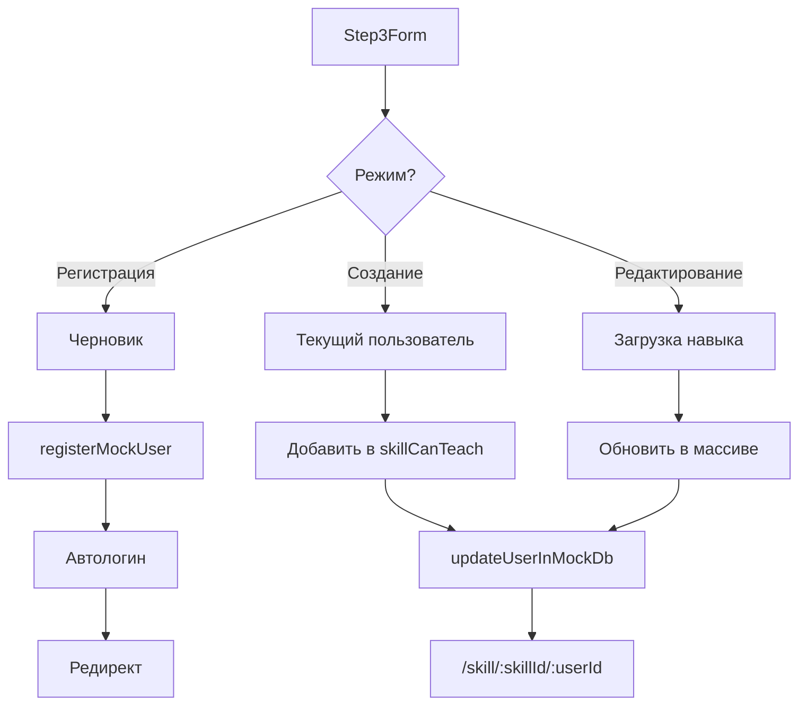

# 🔧 Основные изменения по рефакторингу

Единый источник истины для типа skillCanTeach — везде массив
Устранено дублирование компонентов и страниц
Корректная работа со множественными навыками
Полноценное управление навыками в профиле (CRUD операции)

1. **Унификация типа `skillCanTeach`**
   - Было: `skillCanTeach?: SkillTeach` (один объект)
   - Стало: `skillCanTeach?: SkillTeach[]` (массив объектов)
   - Причина: поддержка нескольких навыков, которыми может научить пользователь

2. **Устранение дублирования компонентов**
   - `SkillCard` и `CatalogCard` — объединены в один компонент `CatalogCard`
   - Теперь `CatalogCard` поддерживает:
     - `variant="default" | "compact"` — разные размеры
     - `hideButton` — скрывает кнопку и лайк (для страницы навыка)
     - `activeSkillId` — показывает конкретный навык из массива

3. **Унификация страницы создания навыка**
   - Удалён дубликат `CreateSkillPage.tsx`
   - Расширен `Step3Form.tsx` для поддержки:
     - Создание навыка при регистрации нового пользователя
     - Создание нового навыка авторизованным пользователем
     - Редактирование существующего навыка

4. **Исправление типов во всех связанных файлах**
   - `usersApi.ts` — нормализация данных (объект → массив)
   - `registerMockUser.ts` — параметр `skillCanTeach` теперь массив
   - `buildCatalogItems.ts` — итерация по массиву навыков
   - `CatalogCard.tsx` — работа с первым элементом массива
   - `SkillPage.tsx` — поиск конкретного навыка по `activeSkillId`
   - `useSkillPage.ts` — проверка наличия навыка через `some()`

---

# 📄 Логика работы страниц

## 1. Страница навыка (`/skill/:skillId/:userId`)

**Назначение:** отображение информации о конкретном навыке конкретного пользователя.

**Компоненты:**

- `SkillPage.tsx` — основной компонент
- `useSkillPage.ts` — хук для загрузки данных
- `CatalogCard` — карточка пользователя (левая колонка)

**Логика работы:**

1. Получение `skillId` и `userId` из URL параметров
2. Загрузка пользователя по `userId` (или поиск по `skillId`, если `userId` не указан)
3. Проверка, что у пользователя есть навык с указанным `skillId`
4. Отображение:
   - Левая колонка: карточка пользователя (`CatalogCard` с `hideButton` и `activeSkillId`)
   - Правая колонка: название навыка, описание, галерея фото, кнопка "Предложить обмен"
   - Блок "Похожие предложения": другие пользователи с таким же навыком (`CatalogCard` в компактном режиме)

## 2. Страница профиля — вкладка "Мои навыки" (`/profile?tab=skills`)

**Назначение:** управление навыками пользователя.

**Компоненты:**

`ProfilePage.tsx` (case 'skills')

`CatalogCard` — для отображения навыков (не используется напрямую)

**Логика работы:**

Раздел "Могу научить":
Отображение всех навыков из массива `user.skillCanTeach`

У каждого навыка есть кнопки:

[Редактировать] → переход на `/skill/:skillId/edit` (открывается `Step3Form` в режиме редактирования)

[Удалить] → удаление навыка из массива (без подтверждения)

Раздел "Хочет научиться":
Отображение навыков из массива `user.skills` (ID субкатегорий)

Для отображения названия используется компонент `SkillName`

Кнопка "+ Добавить" → открывается модалка с каталогом доступных навыков

Кнопка "×" → удаление навыка из списка

## 3. Создание/Редактирование навыка (/create или /skill/:skillId/edit)

**Назначение:** форма для создания нового навыка или редактирования существующего.

**Компонент:** `Step3Form.tsx`

**Логика работы:**

Режимы:
Регистрация нового пользователя (шаг 3 из 3)

Сохранение навыка в черновик

После регистрации навык сохраняется в `skillCanTeach` (как массив)

Создание нового навыка авторизованным пользователем

Добавление нового навыка в существующий массив `skillCanTeach`

Обновление пользователя через `updateUserInMockDb`

Редактирование существующего навыка

Загрузка текущих данных навыка по `skillId`

Обновление навыка в массиве `skillCanTeach`

